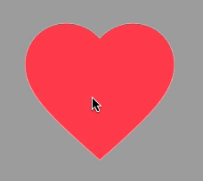

# flutter_switch_clipper

A Flutter package that two widgets switch with clipper.

## 1.使用

```dart
SwitchCipper(
    initSelect: true,
    child: const Icon(Icons.favorite, size: 200, color: Colors.redAccent),
    background: const Icon(Icons.favorite, size: 200, color: Colors.white),
    fillAlignment: _alignment,
    fillOffset: 50,
    duration: const Duration(milliseconds: 800),
    onSelect: (bool r) {
        print(r);
    },
),
```

```dart
SwitchCipper(
    child: const Text(
        'FlutterCandies',
        style: TextStyle(
            fontWeight: FontWeight.bold,
            fontSize: 50,
            color: Colors.amber,
            height: 2,
        ),
    ),
    background: const Text(
        'FlutterCandies',
        style: TextStyle(
            fontWeight: FontWeight.bold,
            fontSize: 50,
            color: Colors.white,
            height: 2,
        ),
    ),
    fillAlignment: _alignment,
    curve: Curves.slowMiddle,
    reverseCurve: Curves.linear,
    fillOffset: 10,
),
```




## 体验一下

体验网址:[https://sc.liugl.cn](https://sc.liugl.cn)

